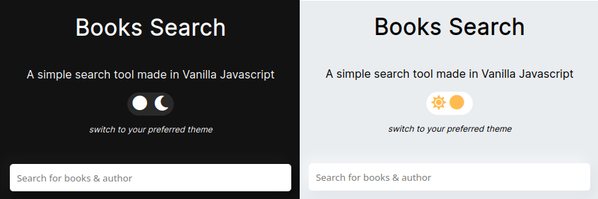
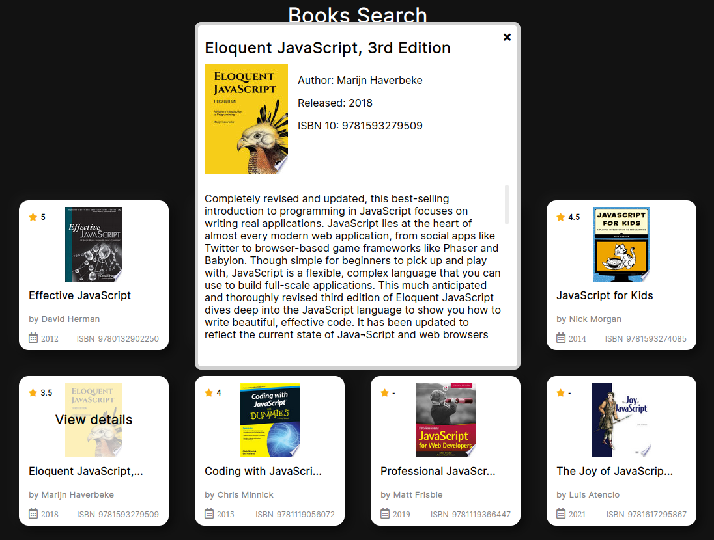

# Book Finder API

The book finder app using Vanilla Javascript and [Google Books API](https://developers.google.com/books/). 

## Features
- Search books using the [Google Books API](https://developers.google.com/books/).
- 40 results are shown .
- Switch theme light/dark.
- Modal window shows the details of the book.

## Installation

```
 git clone https://github.com/martindocs/book-finder.git

 # cd into the project directory

 # If you have Live Server, visit http://localhost:5500 
 
 # Otherwise just double click index.html
```

## Screenshot
<p style="text-align:center;">
    
    
    
</p>

## Contributing

Pull requests are much appreciated and accepted.

1. <a href='https://help.github.com/articles/fork-a-repo/'>**Fork**</a> the repo on GitHub.
2. <a href='https://help.github.com/articles/cloning-a-repository/'>**Clone**</a> the project to your own machine.
3. <a href='https://git-scm.com/book/en/v2/Git-Basics-Recording-Changes-to-the-Repository'>**Commit**</a> changes to <a href='https://git-scm.com/book/en/v2/Git-Branching-Branches-in-a-Nutshell'>**development branch**</a>.
4. <a href='https://help.github.com/articles/pushing-to-a-remote/'>**Push**</a> your work back up to your fork.
5. Submit a <a href='https://help.github.com/articles/about-pull-requests/'>**Pull request**</a> so that i can review your changes

## License

Please refer to the [LICENSE](./LICENSE.md) file in this repository for details on how this project is licensed.
